# Kutuphane Sistemi 
# Genel Özet
## Proje Amacı
Kütüphanelerin üye ve kitap yönetim işlemlerini kolaylaştırmak.

# Site için görüntüler
## Yönetici Giriş Sayfası
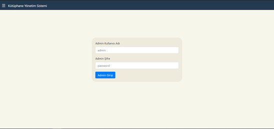
•	Kütüphane görevlisinin sisteme bilgileri ile giriş yaptığı sayfa.

## İşlem Menüsü
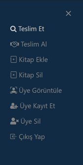
•	Görevlinin yapabileceği işlemleri gösteren menü.
•	Teslim Et: Kitap arayıp o kitabı bir üyeye emanet etme işlemini yapacağı sekme.
•	Teslim Al: Üyenin bilgilerini ve teslim edeceği kitabın ISBN bilgisini alarak kitabı teslim alır.( Eğer böyle bir üye yoksa veya kitabı emanet almamışsa işlem gerçekleşmez.
•	Kitap Ekle: Kütüphane de bulunan veya ilk defa eklenecek bir kitabı kaydetme işlemini yapacağı sekme. 
•	Üye Görüntüle: Üyenin E-posta ve telefon numarasını alarak sisteme girdiğine, üye bilgilerini, teslim ettiği ve şuan onda olan emanet aldığı kitapları görüntüleyebileceği sekme.
•	Üye Kayıt Et: Kayıt olmak isteyen insanın gerekli bilgi alanları doldurulduktan sonra sisteme ekleyen sekme.
•	Üye Sil: Kütüphane sisteminden kaydını silmek isteyen kişinin gerekli bilgilerini girdikten sonra Adres,Telefon, E-posta, Emanet aldığı kitaplar gibi bilgileri veritabanından silen sekme.
•	Çıkış Yap: Görevilinin sistemden çıkış yapmasını sağlayan sekme.

## Teslim Et
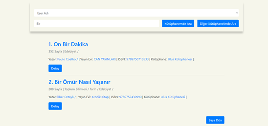
•	Teslim Et sayfası görevlinin kitapları görüntüleyebileceği sayfadır. 
•	Eser Adı veya ISBN’ye göre arama yapabilir.
•	Kütüphanemde Ara seçilirse sadece kendi kütüphanesinde olan kitapları görüntüleyebilir.
•	Örneğin üye kütüphane görevlisine aradığı kitap var mı diye sorduğunda kendi kütüphanesinde yoksa üyeye hangi kütüphanede bulabileceği bilgisini verebilmek için diğer kütüphanelerde arama işlemi yapabilir. 
  Ancak diğer kütüphanelerden emanet işlemini gerçekleştiremez. Çünkü görevlilerin sadece kendi kütüphanelerinde yetkileri vardır.
•	Detayını görüntülemek ve kendi kütüphanesindeki kitabı emanet verebilmek için detaya basarsa 
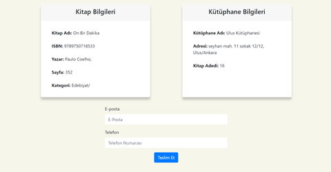
•	Böyle bir sayfaya yönlendirilir ve Kitap adedi ve kütüphane bilgilerini görüntüleyebilir. Eğer kendi kütüphanesindeki bir kitabın detaylarını görüntülüyorsa altta çıkan formlardan üyeye  bu kitabı emanet verebilir.
  Üye bilgilerini doldurduktan sonra Teslim Et’e basarsa bilgileri girilen üyeye bu kitap teslim edilmiş olur.

## Kitap Ekle
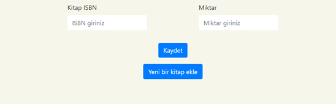
•	Kitap eklemede 2 durum vardır.
•	İlki kütüphanenize daha önceden eklemiş olduğunuz bir kitabı tekrar eklemek istersiniz veya kütüphanenizde olmayan ve ilk defa ekleyeceğiniz bir kitabı eklemek istersiniz.
•	Yukardaki görsel ilk durum için gösterilen ekran bu sayfada eklemek istediğiniz kitabın ISBN’si ve miktar bilgisini girdikten sonra ekleme işlemi tamamlanmış olur.
•	Ancak daha önceden eklemediğiniz bir kitabı eklemek isterseiniz

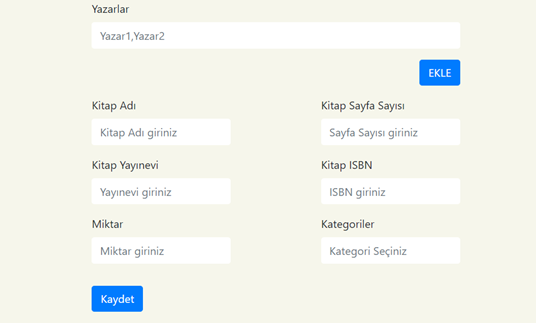
•	Böyle bir ekrana yönlendirilir ve kitabın gerekli bilgilerini girdikten sonra kaydederseniz. Kitap sisteme eklenmiş olur. 

## Kitap Sil
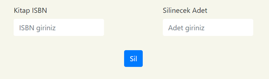
•	Kitap Silme işleminde kitabın ISBN bilgisi ve sistemden kaç tane silmek istediğiniz bilgisini girdikten sonra Sil butonuna basarsanız.
•	Kitap sistemden silinmiş olur.
•	Kütüphanenizde bulunmayan bir kitabı silmek isterseniz veya uygun olmayan bir miktar girerseniz ekranda bilgilendirici bir hata mesajı gösterilir.

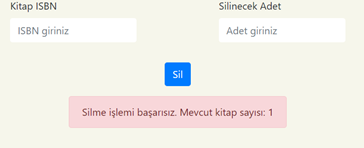

## Üye Görüntüle
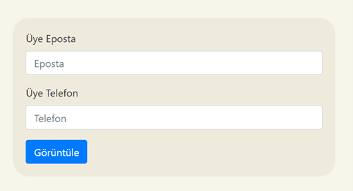
•	Üye görüntüleme ekranında görselde görünün alanları üye bilgileri ile doldurduktan sonra görüntüle butonuna basarsanız.

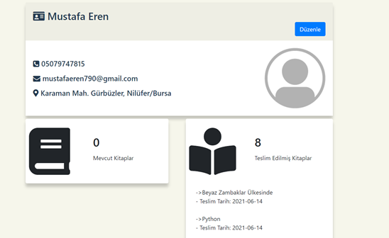
•	Üyenin bilgilerini içeren profil sayfasına yönlendirilirsiniz.
•	Üyenin bilgilerini güncelleyebileceğiniz bir Düzenle Butonu mevcuttur.

## Üye Düzenle
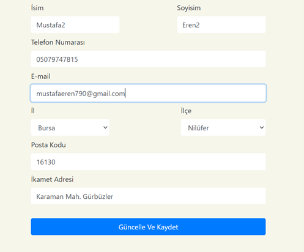
•	Üye Görüntüle ekranından sonra profil sayfasında yer alan Düzenle butonu ile üyenin kayıt olurkenki bilgilerini güncelleyebilirsiniz.

## Üye Kayıt Et
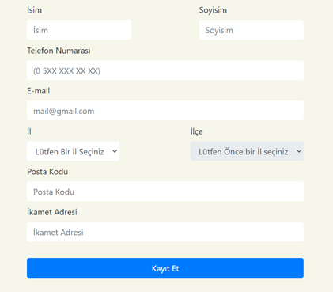
•	Üye kayıt ekranında kayıt olmak isteyen insanın bilgilerini girdikten sonra kayıt ederseniz kütüphaneniz 
ve Kütüphane Yönetim Sisteminin diğer kütüphanelerine bir üye kayıt etmiş olursunuz ve kayıt olan üye kütüphaneden bağımsız olarak emanet işlemleri gerçekleştirebilir.

## Üye Sil
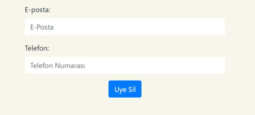
•	Sistemden silinmek istenen üyenin gerekli bilgileri girildikten sonra Uye Sil butonuna basılırsa üyenin veritabanında olan bütün verileri silinir.
( Adres,Telefon, E-posta, Emanet aldığı kitaplar gibi bilgileri)

# Kullanılan Teknolojiler
- HTML
- JavaScript
- CSS
- Python
- MySQL

# Kurulum ve Oynanış
## Github üzerinden indirmek
Proje dosyalarına erişmek ve bunları yerel bilgisayarınızda çalıştırmak için aşağıdaki işlemleri takip edebilirsiniz. 
Bu işlemleri yaptığınız durumda, proje dosyaları ve gerekli kütüphaneler yerel bilgisayarınıza indirilecektir.
1.	git clone https://github.com/MustafaErenn/kutuphane-sistemi
2.	pip install -r requirements.txt

Bu işlemlerden sonra github adresinde yer alan veritabani.sql scriptini kullanarak kütüphane yönetim sisteminin veritabanını bilgisayarınıza oluşturun.
Veritabanının adı alttaki görselde belirtilen isimle aynı olmalıdır. Veritabanı ismi farklı konulmak istenirse buradaki isimde değiştirilmelidir.

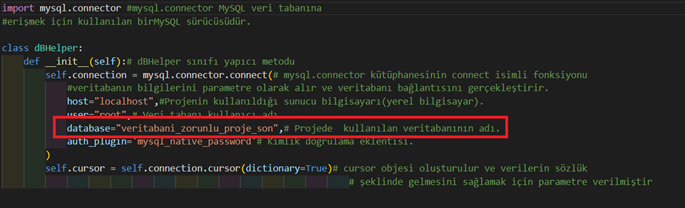
3.	py main.py 

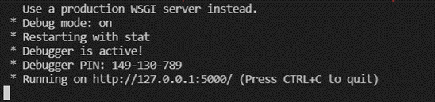
Resimde yer alan Running on … (http://127.0.0.1:5000/) kısmındaki yeri tarayıcınıza yapıştırın. Böylece sistemi kullanmaya başlayabilirsiniz.

# Lisans ve İletişim
Eki Üyeleri 
- [@MustafaErenn](https://github.com/MustafaErenn)
- [@MustafaErenn](https://github.com/MustafaErenn)
- [@MustafaErenn](https://github.com/MustafaErenn)
- [@MustafaErenn](https://github.com/MustafaErenn)
